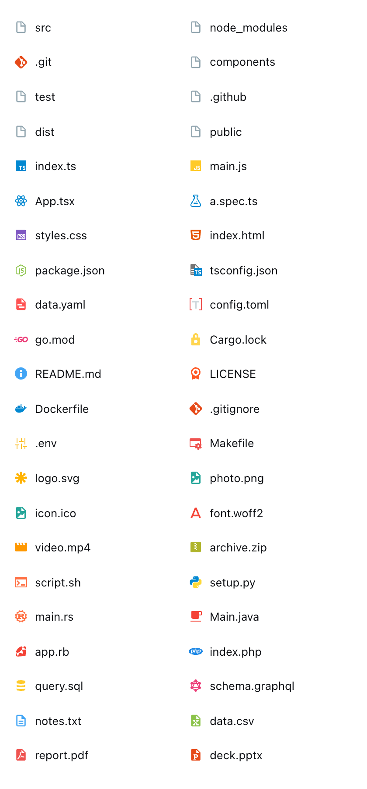
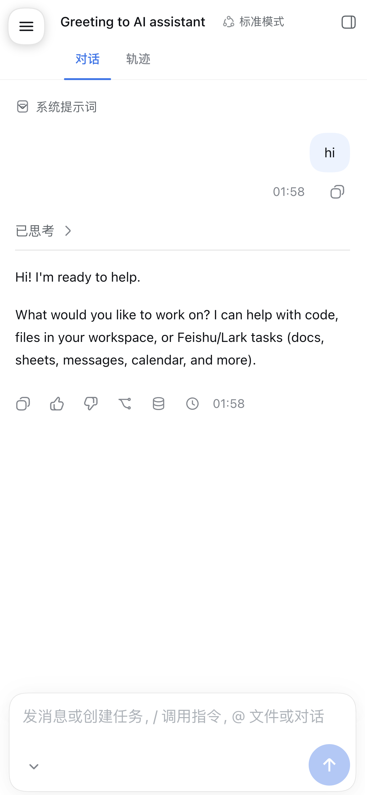

# @jianghuifr/dsh-mobile-ui

[](https://github.com/jianghuifr/dsh-mobile-ui/actions/workflows/ci.yml)
[](https://www.npmjs.com/package/@jianghuifr/dsh-mobile-ui)
[](LICENSE)

> 不带 scope 的 `dsh-mobile-ui` 在 npm 上已被他人占用（`wbaifan`，功能也高度重合），
> 所以这里用自己的 scope 发布，避免混淆。

给 DeepSeek Harness 网页端加一层**移动端布局、样式与触控交互**的客户端插件，
外加**文件浏览器的 Material Icon Theme 图标**。

面向的是「在手机浏览器里打开 `dsh web`」这个场景。桌面端不受任何影响：移动端规则全部挂在
`html[data-dsh-mobile="true"]` 下，而这个属性只在视口宽度 ≤ 1023px 时才出现——和
`AppFrame` 自己的 `SIDEBAR_AUTO_COLLAPSE = 1024` 用同一个阈值，两边对「窄屏」的判断一致。
（文件图标是例外：它跟屏幕宽度无关，桌面端同样生效。）

---

## 文件图标（Material Icon Theme）

文件浏览器里原本所有文件和文件夹都是同一个通用字形。现在按名字解析成
[Material Icon Theme](https://github.com/material-extensions/vscode-material-icon-theme)
的彩色图标：`index.ts` 是蓝色 TS、`App.tsx` 是 React 原子、`Dockerfile` 是鲸鱼、
`.gitignore` 是 Git 标、`src/` 展开时换成打开的文件夹。



### 为什么图标放在宿主侧

上游是 ~1250 个 SVG（1 MB）加一张 398 KB 的映射表。**把整张表发到浏览器**只为了决定屏幕上
那十几个图标画什么，是每个页面都要付一次的代价。

所以反过来：浏览器按**文件名**问，宿主查表、读盘、回 SVG：

```
GET /material-icons/index.ts      -> typescript.svg
GET /material-icons/src?d=1&o=0   -> folder-src.svg
GET /material-icons/src?d=1&o=1   -> folder-src-open.svg
```

客户端因此**不需要任何映射数据**，只设一个 `background-image`；每个 URL 都是
`(文件名, 标志位, 版本)` 的纯函数，所以响应带 `immutable` 缓存——同一个图标一辈子只请求一次，
一个目录列表总共也就几个小请求（实测每个 215 B – 1.3 KB）。

解析顺序照着 VS Code 来，因为上游的表就是给它生成的：**全名 → 忽略大小写全名 →
逐级变短的扩展名链（`a.spec.ts` → `spec.ts` → `ts`）→ 主题默认**。文件夹多一个展开态。
`test/resolve.test.mjs` 把这套契约固定下来了——注意里面的期望值是**上游的真实行为**而不是
直觉：`package.json` 是 Node 六边形，`App.tsx` 映射到 `react_ts`，而 `Cargo.toml` 上游压根
没有条目，会落到 `toml`。

### 更新图标集

图标已经**拷贝进插件**（`assets/`），运行时完全不读 VS Code 的扩展目录，所以升级 VS Code
不会把它弄坏。要跟进上游版本：

```bash
node scripts/vendor-icons.mjs              # 自动找已装的 material-icon-theme
node scripts/vendor-icons.mjs --from <dir> # 或指定目录
```

### 图标没出现？

**这一项需要重启 `dsh web`**，和插件的其它部分不一样：路由注册在宿主半边上，而宿主半边
不会热重载（客户端半边会）。重启前宿主对 `/material-icons/...` 回 404，此时客户端会**退回
App 自带的图标**而不是把图标列变空——这条降级路径是特意做的，也有测试覆盖。

---

## 为什么需要它（移动端）

0.1.5-rc.2 的 Web 客户端**没有任何按视口宽度生效的样式**。静态 shell 的 CSS 里只有 3 条
`@media`，全是 `prefers-reduced-motion`；全部 8 个宽度断点都在设置页、引导页、轨迹表这类叶子
面板里。外壳唯一的「移动适配」是 JS：`AppFrame` 在 1024px 以下把侧边栏折叠成 rail，而
`computeColumns` 里有一条 **400px 的中间列下限 + 恒定 56px 的 rail**。

结果是在 390px 的手机上：

| 现象 | 实测 |
| --- | --- |
| 侧边栏折叠后仍占 56px（14% 屏宽），中间列只剩 334px | `sidebarCol {0,0,56,844}` |
| `--dsh-chat-content-width` 下限是硬编码的 680px，在 334px 的列里横向溢出 | JS `CONTENT_MIN = 640` |
| 展开侧边栏时是挤压而非覆盖，中间列被压到 **110px**，输入框 **64px** | `centerCol w=110`，`composer w=64` |
| 设置面板是 164px 导航 + 内容的固定两列，正文挤成**每行一两个字** | `docs/before-settings.png` |
| 输入区字号 14px / 搜索框 13px → **iOS 聚焦时整页缩放** | `composerFont: 14px` |
| 发送键 34×34，附件/模型/权限 28×28，会话行 32px，行内操作图标 16×16 | 实测 hit target |
| 20 处控件只在 `:hover` 出现，触屏永远够不到 | `rowActions`、`chevron`、`inspectButton`… |
| 全站 `:active` 反馈只有 2 个元素；`touch-action: manipulation` 0 处 | 112 个样式表里 |
| 无 `viewport-fit=cover`、无 `env(safe-area-inset-*)`、无 `dvh` | 刘海/小白条区域不可用 |
| 右侧面板在 `rightbarCol` 宽度为 0 时只能整屏 overhang | `panel {0,0,390,844} fixed` |

---

## 安装

```bash
# 从 npm 安装（推荐）
dsh plugin --profile web add @jianghuifr/dsh-mobile-ui
# 装完重启一次 dsh web —— profile 的 bundles 变了
```

发版流程（staged publishing + trusted publishing，无需长期 token）见
[docs/release.md](docs/release.md)。

也可以从本仓库用 `link:` 装，或者手工加 Loader 行（见下）。

插件分成两半，两边的刷新方式不一样：

- **`lib/client.js`** —— 手写的、不需要构建的客户端 bundle，装下全部移动端布局与样式。
  它在浏览器里**热重载**，改完刷不刷新都行。
- **`lib/index.js`** —— 宿主半边。它只做一件事：注册 `/material-icons` 图标路由（外加
  `assets/` 里 vendored 的图标集）。它**不会热重载**，改到它就**必须重启 `dsh web`**。

客户端半边不能单独存在：`@deepseek-ai/dsh-client-modules` 的扫描以 Loader 行为入口，
所以哪怕只有客户端逻辑，也需要这一行。

### 手机上点「新建工作区」却弹在 Mac 上？

这是**宿主侧的配置**，不是本插件能改的，但用手机时一定会撞到。

`dsh-web-app` 挂的是 `@deepseek-ai/dsh-host-directory-picker-auto`，它在**启动时采样一次**
宿主情况来决定用哪种交互：

```js
if (bindHost !== '127.0.0.1') return 'browse'   // 非回环绑定 = 可能有远程浏览器
if (ssh)                       return 'browse'   // 选择器会开在无人值守的服务器上
if (darwin || win32)           return 'native'
```

**它看不到隧道。** 把 `dsh web --host 127.0.0.1` 通过 cloudflared / tailscale 暴露出去时，
在它眼里仍然是「只有本机能连」，于是在 macOS 上选了 `native` —— 手机点「新建工作区」，
访达弹在 Mac 上，手机上什么都不发生（实测确认：注入到页面的对话框数量为 0）。

固定成网页版选择器，两端一致（`dsh-web-app` 注释里写的就是这个做法）：

```yaml
# ~/.dsh/profiles/web/cordis.patch.yml
- id: directory-picker
  disabled: true
- insert:
    - id: directory-picker-browse
      name: '@deepseek-ai/dsh-host-directory-picker-browse'
    - id: directory-picker-browse-surface
      name: '@deepseek-ai/dsh-client-ui-directory-picker-browse'
```

两个包都要挂：宿主后端提供能力，客户端界面占据 ui-workspace 的目录选择插槽
（它走 `slots.inject()`，所以 workspace 面板晚一点激活也能接上）。

代价是 Mac 上也不再弹访达，改用网页选择器。这个 seam 是**每次启动解析一个后端**、
不是按请求解析的，所以做不到「Mac 用原生、手机用网页」。

### 方式 A：`dsh plugin`（推荐，需要重启一次）

```bash
dsh plugin --profile web add link:$HOME/.dsh/plugins/dsh-mobile-ui   # 本地源码
dsh plugin --profile web add @jianghuifr/dsh-mobile-ui              # 或从 npm
# dsh.profile.bundles 变了，需要重启 dsh web 才生效
```

用 `link:` 而不是 `file:`：`file:` 是硬链接拷贝，之后改代码不会同步；`link:` 是符号链接，
编辑立即生效（配合客户端 HMR，改 `lib/client.js` 不用刷新页面）。

### 方式 B：手工加行（**不用重启**，刷新页面即可）

`patchReload: live` 的 profile 会监听 `cordis.patch.yml`，新增 Loader 行可以热生效：

```bash
mkdir -p ~/.dsh/profiles/web/node_modules/@jianghuifr
ln -sfn ~/.dsh/plugins/dsh-mobile-ui ~/.dsh/profiles/web/node_modules/@jianghuifr/dsh-mobile-ui
```

然后往 `~/.dsh/profiles/web/cordis.patch.yml` **追加**（该文件必须是单个顶层 YAML 数组，
不要追加到已有的 `[]` 之后）：

```yaml
- insert:
    - id: mobile-ui
      name: "@jianghuifr/dsh-mobile-ui"
```

> `@` 是 YAML 的保留起始字符，**名字必须加引号**，否则整个 patch 文件解析失败。

浏览器按一次刷新（F5）即可——新行不会触发 HMR 帧。这条路径**不需要重启**，代价是宿主半边
（也就是文件图标路由）要等下一次重启才生效；在那之前文件浏览器保持 App 自带的图标。

> 两种方式**不要同时用**：同一个包名被两个 Loader 源解析会直接报错
> （`package X resolves from multiple active Loader sources`）。

### 卸载

删掉上面加的行（或 `dsh plugin --profile web remove dsh-mobile-ui`），刷新即可。插件在
`apply` 的 disposer 里移除了自己的 `<style>`、导航按钮和遮罩，也清掉了根元素上的全部属性。

---

## 它做了什么

### 外壳

- **三列栅格收成一列**。`AppFrame` 把 `grid-template-columns` 写成行内样式，所以这里必须
  `!important`；同时给 frame 打上稳定的 `data-dsh-part` 标记——CSS Module 的哈希每个版本
  都会变，插件的样式只能挂在自己打的结构标记上。
- **侧边栏变成真正的抽屉**：固定定位、离屏、带遮罩、可滑动。`data-sidebar-collapsed` 的
  有无是「展开」的唯一信号，而「不存在」没法用选择器表达，所以运行时把它镜像成
  `html[data-dsh-drawer]`。
- **关闭是两段式的**：先让抽屉滑出去，280ms 后再点 App 自己的开关。否则 App 会立刻把宽侧栏
  换成 56px 的图标 rail，于是「会话列表滑出屏幕、图标 rail 滑进来」。
- **注入一个导航按钮**，因为 rail 一旦隐藏，手机上就再没有打开会话列表的入口了。
- **右栏整屏化**，并在隐藏时关掉命中测试（见下面的坑）。
- 去掉两根 8px 的拖拽分隔条：触屏上够不到，只会吞掉横向手势。

### 内容区

- **`--dsh-chat-content-width` 改成 `100%`**，并清掉输入区的左右留白（原值 16px，一屏两侧
  共 64px）——消息终于用满整列宽。
- 顶部栏压缩并右对齐，为导航按钮让出左侧 56px。
- 转录区、代码块、表格、图片都保证在列内滚动，不会撑宽页面。
- 两个滚动容器加 `overscroll-behavior: contain`，避免下拉刷新把会话刷没。

### 输入区

- **所有可聚焦输入面字号 ≥ 16px**（输入区、搜索框、`textarea`）——这是 iOS 聚焦缩放的唯一
  修法。代价是手机上字号设置里 12–15px 会被抬到 16px：不缩放比严格跟设置更重要。
- 发送键 34 → 44px，附件/模式/模型 chip 28 → 36–38px，行距收紧，保证 375px 宽仍是一行。
- 模型 chip 限宽 104px 并省略号截断：它在容器宽度超过 ~360px 时会展开显示完整模型名，正是
  它把 412px 以上的机型顶成两行。
- `visualViewport` 监听键盘高度，写进 `--dshm-kb` 并撑开 frame——iOS 不会因为键盘改变布局
  视口，不处理的话输入框永远在键盘下面。
- **手机上回车 = 换行，只有点发送按钮才发消息。** 软键盘只有一个回车键、没有 Shift，
  「回车即发送」会把每一次想换行的尝试都变成提前发送。桌面端不变，回车仍然发送。
  实现上没有自己插入换行，而是**借用 App 已有的手势**：它的输入框键位表第一行就是
  `if (event?.shiftKey === true) return false;`，交给 Lexical 插入换行。所以这里在捕获阶段
  吞掉普通回车，再派发一个 Shift+Enter —— 走 App 自己的路径，Lexical 的状态天然同步。

  三件必须照旧的事都有守卫：**输入法**（composing / `keyCode === 229` 时回车是确认候选词，
  拦了会毁掉所有中日韩输入）、**`/` 和 `@` 菜单**（回车是选中项，用 `data-trigger-menu`
  识别）、**修饰键组合**（Cmd/Ctrl+Enter 仍然发送，外接键盘行为不变）。

### 触控

- 会话行 32 → 44px，项目行 34 → 44px，工具调用行 24 → 40px，设置导航 40 → 46px。
- `touch-action: manipulation`（去掉双击缩放的 300ms 延迟）、去掉点击灰色高亮。
- 全站 `:active` 按压反馈。
- `(hover: none)` / `(pointer: coarse)` 下把 20 处 hover-only 控件显出来，并隐藏会在触屏上
  卡住的 tooltip。
- 恢复会话行的长按选中（App 对这两处设了 `user-select: none`）。

### 覆盖层

- **设置面板整屏化**：把两列 body 改成纵向堆叠，164px 的导航列变成横向可滚动的标签条，内容列
  拿到整宽。
- 对话框改成底部弹出、菜单限高、toast 避开刘海、代码块内部滚动。
- 右侧面板整屏 + 安全区内边距。

### 效果对照

`docs/` 下是同一台 390×844 视口的 before / after：

| | before | after |
| --- | --- | --- |
| 侧边栏展开 | `before-sidebar.png`（中间列被压到 110px） | `after-sidebar.png`（覆盖式抽屉 + 遮罩） |
| 会话视图 | `before-conversation.png`（334px 内容列） | `after-conversation.png`（整宽 + 单行输入区） |
| 设置 | `before-settings.png`（每行一两个字） | `after-settings.png`（横向标签条 + 整宽内容） |

### 精简

手机屏幕放不下桌面才需要的装饰，默认收掉三组：

- **顶栏**：`在 访达/终端 中打开工作目录` 那对分裂按钮，以及「更多操作」菜单——它唯一的
  条目就是下载 Session 日志；
- **输入框下方的一整排**：指令、附件、访问模式、模型、上下文圆环，只留下一个输入区和最右侧
  的发送键，也就是微信/飞书在手机上的形状；
- **输入框下面那行统计**（轮次/步数/token/缓存命中）。



输入框那排是**折叠**而不是删掉：左侧留了一个很轻的 `⌄`，点开就恢复完整工具排。所谓
「默认折叠」就是这个意思——那几个控件桌面端有用、拇指很少用，但不该彻底够不着。

展开后是**两行**，而且排布是刻意的一行放不下：七个控件在 358px 里塞不下（实测约 404px），
所以工具排留在第一行左侧、模型/圆环/发送作为一组换到第二行右对齐。这里顺带修掉了一个
真实的观感问题——App 原本用 `space-between` 排这一行，只有两个子项时没问题，多出开关变成
三个之后，换行会把开关甩到最左、工具甩到最右，看起来像两簇互不相干的东西。改成
`justify-content: flex-start` 后开关和它的工具就贴在一起了，而 `.trailing` 靠自己的
`margin-left: auto` 依旧靠右。

实现上还有个 React 层面的取舍：这个开关是**追加**到那一行的末尾、再用 flex `order: -1` 挪到
左边的，而不是插到开头。那一行的子节点归 React 管，往前插一个外来节点会让它用来比对的
每个下标错位；追加则完全不动已有的节点顺序。每次同步还会补一次——万一 React 重渲染把它
丢掉，下一帧就回来了。

全部规则都挂在 `html[data-dsh-mobile='true']` 下，桌面端一样都没少（有用例逐项核对桌面
顶栏仍然保有那三个按钮）。

### 安全区

运行时给 `viewport` meta 补上 `viewport-fit=cover`，否则 `env(safe-area-inset-*)` 恒为 0。
补上之后抽屉、右侧面板、输入区、设置面板都会吃到刘海和 home indicator 的 inset。

---

## 维护这个插件时要小心的坑

这些都是实现过程中真实踩到、并且会被「看起来正常」的截图掩盖的问题。

1. **`transform` 会制造 fixed 的包含块。**
   设置对话框渲染在 `sidebarCol` **内部**。抽屉最初用 `transform: translateX()` 滑动，于是
   对话框的 `position: fixed` 相对抽屉解析，被压在 320px 宽的抽屉里，永远盖不满屏幕。
   现在抽屉用 `left` 滑动，并且闭合态**不能**用 `visibility: hidden`——那同样会把内部的
   fixed 后代一起隐藏。闭合态改用 `left: -(w+16px)` + `pointer-events: none`。

2. **App 全局是 `content-box`。**
   任何 `width: 100%` 加上 padding 都会溢出。设置内容列因此溢出 48px（每行两个字），顶部栏
   溢出 16px（把右侧面板按钮推出屏幕、点不到）。凡是本插件钉了宽度的元素都显式
   `box-sizing: border-box`。

3. **负 margin 是桌面版的视觉补偿。**
   顶部栏右侧按钮带 `margin-right: -16px`，在桌面被 28px 的 padding 吸收；手机上会把按钮
   推到屏幕外。按视口给 `padding-right` 之后，必须同时中和这层负 margin（包括里面的
   `_1kL45W_button`）。

4. **固定定位的整屏列会吞掉所有点击 —— 而且它的交互性必须由 CSS 决定，不能由 JS 采样决定。**
   `rightbarCol` 在两种状态下都铺满视口，所以它**永远不能**参与命中测试
   （常驻 `pointer-events: none`），由里面的 panel 自己收回（`pointer-events: auto`）——面板
   关闭时是 `visibility: hidden`，本来就点不到，所以这样是安全的。
   这里踩过两次坑，都是因为把交互性挂在了运行时采样的标志位上：
   - 标志位**滞后**：面板打开时标志还是 `closed`，于是列是 `none`、面板继承了 `none`——
     文件管理器打开后点不动；
   - 标志位**回正得太晚**：等它变成 `open` 时列又成了 `auto`，而面板已经滑走，于是那块
     看不见的 z-index 45 的盒子把**整个界面**锁死。

   面板的最终 `transform` 是在滑动**开始时**一次性写好的，之后不再产生属性变更——任何
   「变化时采样一次」的做法都会采到动画中间态并把它永久锁住。现在除了改成 CSS 静态判定，
   运行时还补了一次动画结束后的复核（`SETTLE_MS`），并且**这条复核不会再排下一次**，
   避免退化成轮询。

5. **`pointer-events: none` 是继承的，而 `position: fixed` 不是。**
   设置对话框挂载在 `sidebarCol` **内部**。抽屉收起时是 `pointer-events: none`（为了不让
   离屏内容可交互），而对话框虽然靠 `fixed` 逃出了抽屉的裁剪、正常铺满全屏，却**继承**了
   `none`——于是它画得好好的，但每一个点都穿透到下面的会话上：点不动、滑不动，看起来就是
   「打开设置后整个页面卡死」。
   这里用了**两套彼此独立的机制**，因为单点采样失效一次就足以冻住整个屏幕：
   - 一条纯结构、零运行时状态的规则：抽屉内任何包含 navCell / dialog / mask 的 overlay
     自己收回交互权；
   - 运行时标志 `html[data-dsh-modal]` 兜住规则没覆盖到的层。

   和上一条同源：**覆盖层的可交互性必须单独断言，几何和截图都证明不了它。**

6. **列向 flex 子项默认 `min-height: auto`。**
   设置内容列因此不肯收缩到内容高度以下，整块被顶出面板底部 38px：既看不到底部，也不会
   滚动。`min-height: 0` 之后滚动容器才真正开始滚。

7. **客户端 bundle 注册的 id 必须等于 package.json 的 name。**
   `client-modules` 用**包名**作为客户端条目的 id（`table.set(packageName, graphRow(packageName, …))`），
   浏览器端会拒绝注册成别的名字的 bundle（`loaded without registering ... via __ModuleLoader__.load`）。
   所以改包名要同时改三处：`package.json` 的 `name`、`cordis.patch.yml` 里的行 `name`、
   以及 `lib/client.js` 里 `window.__ModuleLoader__.load({ id })`。三处不一致插件会直接不加载。
   另外 profile 里的符号链接目录名也要跟着变成 `node_modules/@scope/name`。

8. **空闲时绝不能写 DOM —— 写一次就可能变成一个反馈环。**
   键盘 inset 最初用 `innerHeight - vv.height - vv.offsetTop > 80` 判断，并且**无条件写入**。
   iOS 上地址栏的收起/展开本身就会让 `vv.height` 变化 50–90px，正好骑在 80px 这个阈值上；
   而缩小 frame 又会影响浏览器「要不要显示地址栏」的判断——于是 frame 变矮 → 地址栏弹出 →
   `vv.height` 变小 → inset 变大 → …… **自持的高频循环**，表现为窗口底部一条白色区域不停闪；
   而且与主题无关，所以切回深色也不会停（深色下它只是不那么显眼）。
   现在三条一起用：只有可编辑元素获得焦点时才算键盘、140px 进入 / 70px 退出的滞回、以及
   **值没变就一个字节都不写**。同时 `setAttribute` 即使值相同也会产生 mutation 记录，所以
   插件里所有属性写入统一走 `setAttr` / `toggleAttr`，值相同就跳过。
   这条已由 `quiet`（空闲 3 秒内插件写入必须为 0）和 `vv`（用桩 `visualViewport` 重放地址栏
   抖动，断言 0 次写入；同时真实键盘仍被正确跟踪）两组用例守住。

   修完闪烁之后这里又踩了第二个坑，两个坑恰好是一对：**inset 该跟谁比**。
   当时为了躲开地址栏噪声，基准换成了「见过的最大 `vv.height`」，结果 Android 上
   **输入框被顶到屏幕最上方**。原因是 Chrome 的 `interactive-widget=resizes-content`
   （正是这个插件自己写进 viewport meta 的）会**连布局视口一起缩**——浏览器已经把页面缩好了，
   我再加上一份键盘高度的 padding，就变成缩了两次，输入框被推到差不多屏幕顶端。

   正确的参照物是**布局视口** `window.innerHeight`，不是视觉视口自己的历史：

   | 平台 | `innerHeight` | `vv.height` | 差值 | 该不该补 inset |
   | --- | --- | --- | --- | --- |
   | iOS（键盘浮在页面上） | 不变 | −键盘 | 键盘高度 | **要补** |
   | Android `resizes-content` | −键盘 | −键盘 | ≈0 | **不补**（浏览器已缩） |
   | Android `resizes-visual` | 不变 | −键盘 | 键盘高度 | **要补** |

   地址栏是另一回事：它让两个数**一起**变，差值照样 ≈0，所以不需要任何特例——原来想用基准
   躲开的噪声，用 `innerHeight` 天然就没有了。
   `vv` 用例现在把三种平台都跑一遍；`composer-kb` 再用 `setDeviceMetricsOverride` 缩布局
   视口来模拟 `resizes-content`，断言输入框底边**正好落在可见区底边**、且 inset 保持 0。

9. **一个 bundle 的语法错误会打挂整批插件。**
   客户端 bundle 是普通 script，会被拼进同一个 combo batch。CSS 模板字符串里出现一个反引号
   （在注释里写 `` `left` `` 这种）就会提前结束字符串，整个 batch 连同其它插件一起挂掉。
   改完先跑 `node scripts/check.mjs`。

10. **CSS Module 哈希每个版本都会变。**
   样式选择器要么挂在运行时打的 `data-dsh-part` 上，要么用类名后缀 + 元素类型
   （`button[class*='_toBottom']`——注意 `_toBottomSlot` 也含 `_toBottom`，漏掉元素类型会
   同时命中槽位和按钮）。App 自己提供的 `data-*`（`data-conversation-scroll`、
   `data-composer-seat`、`data-rightbar-col`）最稳定，优先用。
   另外 `data-sidebar-right-panel` 是**模式**标记，面板隐藏时依然存在，判断开合只能用
   计算后的可见性或几何位置。

---

## 验证

分两层。**单元层**跟着 `npm test` 和 CI 走：

```bash
npm run verify     # bundle 完整性检查 + eslint + node --test（25 个用例）
```

**浏览器层**在 `test/browser/`，用无头 Chrome 打真机视口跑真实例。它不进 CI ——
需要浏览器、需要跑着的宿主、有些用例还要模型凭据 —— 但它抓到的恰恰是别的测试抓不到的：

```bash
DSH_BROWSER_URL='http://127.0.0.1:3099/?token=…' npm run test:browser
node test/browser/run.mjs --boot        # 或让它自己起一个临时宿主
```

| 用例 | 证明什么 |
| --- | --- |
| `smoke` | 7 种视口下：单列铺满、无横向溢出、抽屉开合、字号 ≥16px、控制行不换行、导航/发送/输入框真的可点 |
| `simple` | 精简后的顶栏与输入框；桌面端一个都没少 |
| `icons` | 每一行都画上图标、自带字形被隐藏、文件夹展开换图标 |
| `enter` | 回车换行、Shift+Enter 换行、Cmd/Ctrl+Enter 与发送键发送、`/` 菜单仍归菜单、桌面端不变 |
| `quiet` | 空闲时插件**一个字节都不写**（含切到浅色之后） |
| `vv` | 键盘 inset 的三种平台行为，以及地址栏抖动 0 次写入 |
| `cycles` | 每种覆盖层（文件管理、设置、抽屉、嵌套）都能回到可交互的主界面 |
| `composer-kb` | 输入框停在键盘上沿，没有被重复计一次 inset 顶上去 |
| `picker` | 点「添加工作区」在**浏览器里**弹对话框 |

这套东西的存在理由很直接：插件最贵的几个 bug —— 覆盖层画出来却点不动、隐藏的整屏列吞掉
所有点击、输入框飘到屏幕顶端、底部白边高频闪 —— **几何断言和截图全都证明不了**，
只有命中测试、mutation 计数和真实点击能。


`scripts/check.mjs` 是提交前的静态检查（语法、CSS 里的游离反引号、意外的模板插值、顶层 ESM），
也是 CI 的一个独立 job —— 客户端 bundle 是**手写的普通 script 且原样发布**，它的完整性因此是
构建门禁而不是测试细节。

浏览器层的用例断言得比上面那张表更细，几个关键点：

- **可交互性**：导航按钮 / 发送键 / 输入框 / 设置面板的导航、控件、关闭按钮、三张外观卡片，
  全部要在 `elementFromPoint` 下命中自己 —— 「画出来了」和「点得到」是两件事；
- **覆盖层生命周期**：文件管理器开→关、进文件→退出、设置开→切标签→关、抽屉与右栏嵌套，
  每一轮之后主界面都要恢复可交互，并且 2 秒后仍然稳定（不是动画中途的假象）；
- **静默**：空闲 3 秒内插件自身属性写入必须为 0，且在**切到浅色之后**再测一遍；
- **回车契约**：六条各用**全新页面**跑一遍 —— 提交会让智能体跑起来，运行中的智能体会改变
  输入框行为并自己增加消息，共用页面会让「消息数不变」的断言失去意义。

结论：

```
SMOKE PASS / SIMPLE PASS / ICONS PASS / ENTER PASS / QUIET PASS
VV PASS / CYCLES PASS / COMPOSER-KB PASS / PICKER PASS        —— 9/9
```

## 兼容性

针对 `dsh` 0.1.5-rc.1 / `@deepseek-ai/dsh-web-frontend` 0.1.5-rc.2 实测。插件只依赖
DOM 结构、`data-*` 钩子和 CSS 自定义属性，不注入任何 Cordis 服务（`exports.inject = []`），
所以客户端其它插件升级不会影响它；但上游如果改了上面第 10 条列出的结构标记，需要同步调整。
